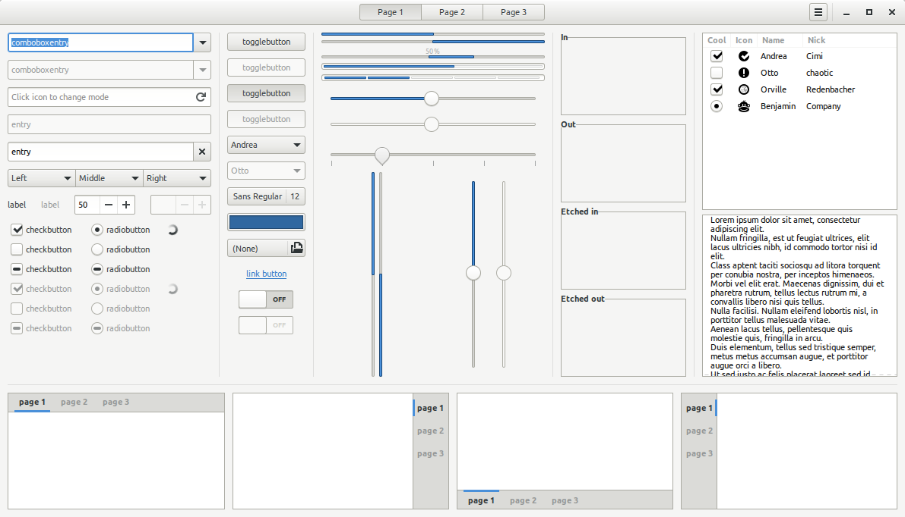
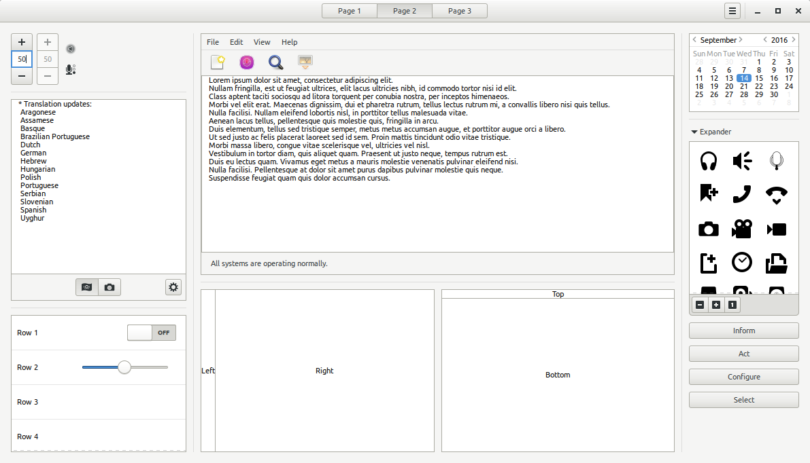
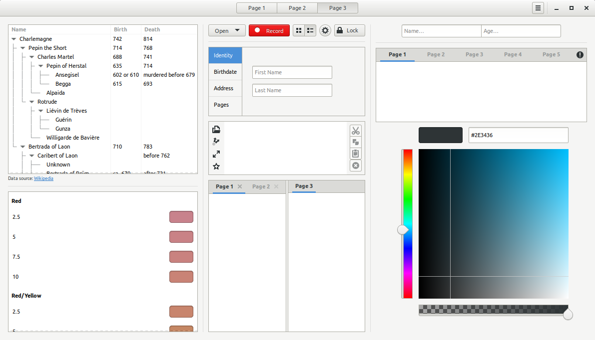

# DEPRECATED: Use https://github.com/godlyranchdressing/Minwaita

# Adwaita Compact
Reduce ugly padding from gnome default theme, Adwaita, to make it more compact and fucking awesome.

## Preview

## Download
 * [3.20.9.1](https://github.com/abihf/adwaita-compact/archive/v3.20.9.1.tar.gz)
 * [3.20.0.1](https://github.com/abihf/adwaita-compact/archive/v3.20.0.1.tar.gz)
 * [3.16.2.1](https://github.com/abihf/adwaita-compact/archive/3.16.2.1.tar.gz)

## Base theme
 - gtk3: https://git.gnome.org/browse/gtk+/tree/gtk/theme/Adwaita/
 - gtk2: https://git.gnome.org/browse/gnome-themes-standard/tree/themes/Adwaita
 - gnome-shell: https://git.gnome.org/browse/gnome-shell-sass/

